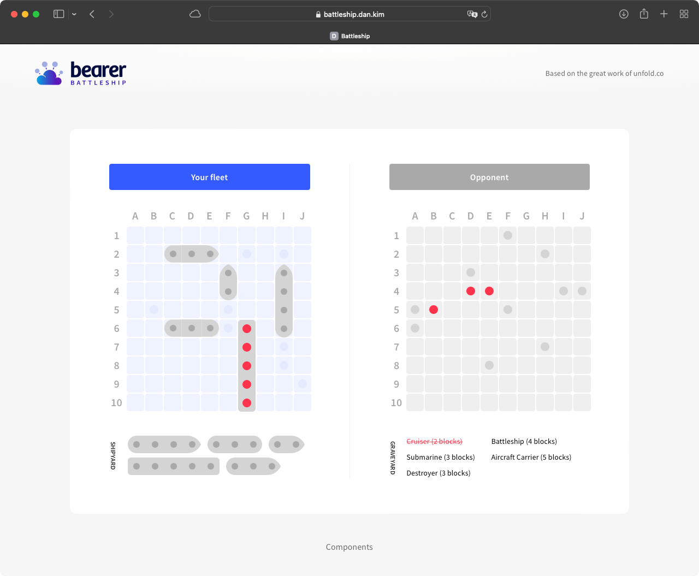

# Battleship

[Live](https://battleship.dan.kim) | [Components](https://battleship.dan.kim/components)

- Ruby version: 3.1
- System dependencies: `$ brew install postgresql`
- Database initialization: `$ rails db:setup`
- How to run the test suite: `$ rails test`

## Components

[ViewComponent](https://viewcomponent.org) is used as the component framework.

## Notes

- Board atom hits and misses are generated randomly on page load (see `app/javascript/home.js`) for code brevity and readability. Alternatively, they could be populated with back-end data (see `app/models/board.rb` and `app/components/board_component.rb`).
- `ShipComponent` uses variants API, to be deprecated in version 3. Variants could potentially be implemented by extracting into additional components or sub-partials.

## To-Do

- [x] Seed random hits and misses
- [x] Deploy
- [x] Add link to components storybook
- [x] Set up ESLint
- [x] Set up RuboCop
- [x] Add LICENSE
- [x] Use variants for different ships
- [x] Add tests
- [ ] Hit animation
- [ ] Test on mobile
- [ ] Add docs and update README
- [ ] Add page titles
- [ ] Validate HTML and CSS; Lighthouse, etc.
